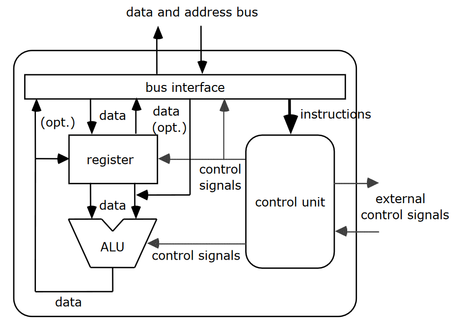

# Klausur 2017

## Aufgabe 1: Rechnerarchitektur

**Skizzieren Sie die grundlegende Architektur eines einfachen Mikroprozessors inkl. interner Busse**

**Gehen Sie von einer 5-stufigen Pipeline (IF, ID, OF, EX, WB) aus. Welche sinnvollen Schnittstellengibt es in welcher Stufe zur übrigen CPU, und wie müssen diese beschaffen sein?**

| Pipeline Stage | Schnittstellen                            | Beschaffenheit |
| -------------- | ----------------------------------------- | -------------- |
| **IF**         | Program Counter, Speicher für Instruktion |                |
| **ID**         | Steuerwerk                                |                |
| **OF**         | Register, ALU                             |                |
| **EX**         | ALU                                       |                |
| **WB**         | Register, Speicher                        |                |

**Warum ergibt sich bei der Harvard-Architektur eine Leistungssteigerung?**

In der Harvard-Architektur liegen Daten und Programme auf getrennten Speichern mit getrennten Bussystemen. Dadurch können Befehle und Daten parallel verarbeitet werden, was eine Leistungssteigerung mit sich bringt.

### Aufgabe 2: Zahlensysteme

**Zahlenumrechnungen**

**Zahlenformate**

**Worin liegt ein Vorteil der Zweier- gegenüber der Einerkomplementdarstellung?**

Im Einerkomplement gibt es zwei Möglichkeiten, die 0 darzustellen. Das Zweierkomplement eliminiert dieses Problem, wodurch der Zahlenbereich um eine Zahl erweitert wird.

### Aufgabe 3: Gleitkommazahlen

### Aufgabe 4: Pipelining

**Definieren Sie Pipeline Forwarding. Wie viele Takte sparen Sie dadurch bei einem Data hazard?**

In einer Pipeline mit EX-zu-EX-Forwarding können Ergebnisse der EX-Stage direkt im nächsten Takt für die nächste Instruktion wiederverwendet werden.

### Aufgabe 5: Memory

**Ein Programm möchte ein Array A (Länge:100Byte) byteweise mit einem Zähler i (zu Beginn 0) durchlaufen. Der Inhalt von A befindet sich bisher ausschließlich im Hauptspeicher und beginnt dort an der Adresse42. Der Hauptspeicher kann in 32 Byte langen Zeilen ausgelesen werden, also an Adresse 0, 32, 64,  . . .  . Der Cache ist auch genau für 32 Byte große Cachelines gebaut.**

1. **Welche Bytes aus dem Hauptspeicher (Angabe von Adressen) gelangen wann in den Cache?**

   | Verlauf                                                      |
   | ------------------------------------------------------------ |
   | Versuche, 42 zu laden. **Cache miss.** Lade 42 - 63 in den Cache und 42 an CPU weiter. **= 1 Cache miss** |
   | Versuche, 43 - 63 zu laden. **= 21 Cache hits**              |
   | Versuche, 64 zu laden. **Cache miss.** Lade 64 - 95 in den Cache und 64 an CPU weiter. **= 1 Cache miss** |
   | Versuche, 65 - 95 zu laden. **= 31 Cache hits**              |
   | Versuche, 96 zu laden. **Cache miss**. Lade 96 - 127 in den Cache und 96 an CPU weiter. **= 1 Cache miss** |
   | Versuche, 97 - 127 zu laden. **= 31 Cache hits**             |
   | Versuche, 128 zu laden. **Cache miss.** Lade 128 - 159 in den Cache und 128 an CPU weiter. **= 1 Cache miss** |
   | Versuche, 128 - 141 zu laden **= 14 Cache hits**             |

2. **Warum beschleunigt der Einsatz eines Caches den Programmabfluss (im Allgemeinen), wenn doch offensichtlich mehr Schritte und insbesondere deutlich mehr Hardwareaufwand betrieben werden muss?**

3. **Definieren Sie die Begriffe örtliche und zeitliche Lokalität. Nennen Sie mind. jeweils ein Beispiel.**