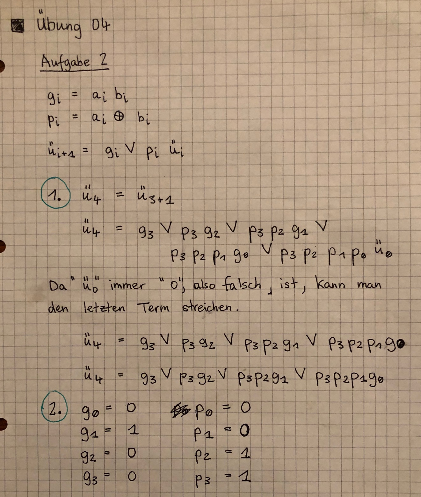
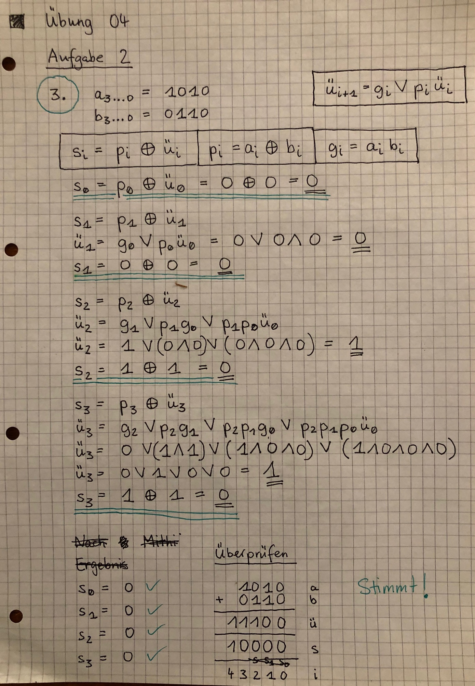

# 4. Übungszettel

Felix Suhl, Leander Tolksdorf

## Aufgabe 1

### [ B+V ]
Bei B+V Darstellung wird (meist) das Most-Significant-Bit als Vorzeichen-Bit verwendet; der maximale Betrag ist geringer.

- ### <ins>23 + 81</ins>
    **23** in B+V: `0|0010111` \
    **81** in B+V: `0|1010001`

    |          |      | (0)  | 0    | 0    | 1    | 0    | 1    | 1    | 1    |
    | -------- | ---- | ---- | ---- | ---- | ---- | ---- | ----     | ---- | ---- |
    | +        |      | (0)  | 1    | 0    | 1    | 0    | 0        | 0    | 1    |
    | Übertrag |      |      |      | 1    |      | 1    | 1        | 1    |      |
    | Ergebnis |      | (0)  | 1    | 1    | 0    | 1    | 0        | 0    | 0    |

    Da zwei positive Zahlen addiert werden, ist das Vorzeichenbit des Ergebnisses 0.

    Ergebnis in B+V: `0|1101000` (**104**)

- ### <ins>36 - 14</ins>
    **36** in B+V: `0|0100100` \
    **-14** in B+V: `1|0001110`

    |          |      | (0)  | 0    | 1    | 0    | 0    | 1        | 0    | 0    |
    | -------- | ---- | ---- | ---- | ---- | ---- | ---- | ----     | ---- | ---- |
    | +        |      | (1)  | 1    | 1    | 1    | 0    | 0        | 1    | 0    |
    | Übertrag |      | 1    | 1    |      |      |      |          |      |      |
    | Ergebnis |      | (0)  | 0    | 0    | 1    | 0    | 1        | 1    | 0    |

    Da das Ergebnis der Rechnung positiv ist, ist das Vorzeichenbit des Ergebnisses 0 und wir subtrahieren den zweiten vom ersten Betrag mittels Zweierkomplement. \
    In B+V-Darstellung wird der Übertrag auf das reservierte Vorzeichen-Bit ignoriert. Das Ergbnis ist mit +22 trotzdem richtig.

    Ergebnis in B+V: `0|0010110` (**22**)

- ### <ins>72 - 87</ins>
    **72** in B+V: `0|1001000` \
    **-87** in B+V: `1|1010111`

    |                 |      | (0)  | 1    | 0    | 0    | 1        | 0    | 0    | 0    |
    | --------------- | ---- | ---- | ---- | ---- | ---- | ----     | ---- | ---- | ---- |
    |                 |      | (1)  | 0    | 1    | 0    |     1    | 0    | 0    | 1    |
    | Übertrag        |      |      |      |      | 1    |          |      |      |      |
    | Ergebnis im ZK  |      | (1)  | 1    | 1    | 1    | 0        | 0    | 0    | 1    |
    | Ergebnis in B+V |      | (1)  | 0    | 0    | 0    | 1        | 1    | 1    | 1    |

    Da das Ergebnis negativ ist, setzen wir das Vorzeichen-Bit auf 1 und rechnen die Subtraktion im Zweierkomplement. Danach muss der Betrag noch aus dem Zweierkomplement zurückgebildet werden, damit der Betrag positiv ist. \

    Ergebnis in B+V: `1|0001111` (**-15**)

- ### <ins>-113 - 37</ins>
    **-113** in B+V: `1|1110001` \
    **-37** in B+V: `1|0100101`

    |          |      | (1)   | 1    | 1    | 1    | 0    |     0    | 0    | 1    |
    | -------- | ---- | ----- | ---- | ---- | ---- | ---- |     ---- | ---- | ---- |
    | +        |      | (1)   | 0    | 1    | 0    | 0    |     1    | 0    | 1    |
    | Übertrag |      | **1** | 1    |      |      |        |      | 1    |      |
    | Ergebnis |      | (1)   | 0    | 0    | 1    | 0    |     1    | 1    | 0    |

    Da beide Zahlen negativ sind, addieren wir einfach die Beträge und setzen das Vorzeichen Bit. \
    Wir haben in der Addition einen Übertrag auf das Vorzeichenbit. Dadurch ist der Betrag falsch. Um das Ergebnis dieser Addition richtig darzustellen, benötigt es in der B+V-Darstellung mindestens 9 Bit.

    Falsches Ergebnis in B+V: `1|0010110` (**-150 nicht darstellbar mit 8-Bit B+V**)

### [ Einerkompliment ]
In einem Einerkompliment-System werden negative Binärzahlen als invertierte Binärzahlen dargestellt. Dabei wird beim binären Betrag der negativen Zahl alle Bits invertiert (umgedreht).

- ### <ins>23 + 81</ins>
    **23** im Einerkompliment: `00010111` \
    **81** im Einerkompliment: `01010001`

    |          |      | 0    | 0    | 0    | 1    | 0    | 1        | 1    | 1    |
    | -------- | ---- | ---- | ---- | ---- | ---- | ---- | ----     | ---- | ---- |
    | +        |      | 0    | 1    | 0    | 1    | 0    | 0        | 0    | 1    |
    | Übertrag |      |      |      | 1    |      | 1    | 1        | 1    |      |
    | Ergebnis |      | 0    | 1    | 1    | 0    | 1    | 0        | 0    | 0    |

    Ergebnis im Einerkompliment: `01101000` (**104**)

- ### <ins>36 - 14</ins>
    **36** im Einerkompliment: `00100100` \
    **-14** im Einerkompliment: `11110001`

    |          |      | 0    | 0    | 1    | 0    | 0    | 1        | 0    | 0    |
    | -------- | ---- | ---- | ---- | ---- | ---- | ---- | ----     | ---- | ---- |
    | +        |      | 1    | 1    | 1    | 1    | 0    | 0        | 0    | 1    |
    | Übertrag | 1    | 1    | 1    |      |      |      |          |      |      |
    | Ergebnis | 1    | 0    | 0    | 0    | 1    | 0    | 1        | 0    | 1    |

    Da wir einen Übertrag haben, müssen wir diesen noch auf das     Zwischenergebnis addieren:

    |          |      | 0    | 0    | 0    | 1    | 0    | 1        | 0    | 1    |
    | -------- | ---- | ---- | ---- | ---- | ---- | ---- | ----     | ---- | ---- |
    | +        |      | 0    | 0    | 0    | 0    | 0    | 0        | 0    | 1    |
    | Übertrag |      |      |      |      |      |      |          | 1    |      |
    | Ergebnis |      | 0    | 0    | 0    | 1    | 0    | 1        | 1    | 0    |

    Ergebnis im Einerkompliment: `00010110` (**22**)

- ### <ins>72 - 87</ins>
    **72** im Einerkompliment: `01001000` \
    **-87** im Einerkompliment: `10101000`

    |          |      | 0    | 1    | 0    | 0    | 1    | 0        | 0    | 0    |
    | -------- | ---- | ---- | ---- | ---- | ---- | ---- | ----     | ---- | ---- |
    | +        |      | 1    | 0    | 1    | 0    | 1    | 0        | 0    | 0    |
    | Übertrag |      |      |      |      | 1    |      |          |      |      |
    | Ergebnis |      | 1    | 1    | 1    | 1    | 0    | 0        | 0    | 0    |

    Ergebnis im Einerkompliment: `1110000` (**-15**)

- ### <ins>-113 - 37</ins>
    **-113** im Einerkompliment: `10001110` \
    **-37** im Einerkompliment: `11011010`

    |          |      | 1    | 0    | 0    | 0    | 1    | 1        | 1    | 0    |
    | -------- | ---- | ---- | ---- | ---- | ---- | ---- | ----     | ---- | ---- |
    | +        |      | 1    | 1    | 0    | 1    | 1    | 0        | 1    | 0    |
    | Übertrag | 1    |      |      | 1    | 1    | 1    | 1        |      |      |
    | Ergebnis | 1    | 0    | 1    | 1    | 0    | 1    | 0        | 0    | 0    |

    Der Übertrag muss noch auf das Zwischenergebnis addiert werden, also ist das Ergebnis:

    Falsches Ergebnis im Einerkompliment: `01101000` (**-150 nicht darstellbar**) \
    Nur Zahlen von -127 bis 127 können im 8-Bit Einerkompliment dargestellt werden)

### [ Zweierkompliment ]
In einem Zweierkompliment-System werden negative Binärzahlen auch invertiert dargestellt, nur wird die invertierten Darstellung zusätzlich mit 1 addiert.

- ### <ins>23 + 81</ins>
    **23** im Zweierkompliment: `00010111` \
    **81** im Zweierkompliment: `01010001`

    |          |      | 0    | 0    | 0    | 1    | 0    | 1        | 1    | 1    |
    | -------- | ---- | ---- | ---- | ---- | ---- | ---- | ----     | ---- | ---- |
    | +        |      | 0    | 1    | 0    | 1    | 0    | 0        | 0    | 1    |
    | Übertrag |      |      |      | 1    |      | 1    | 1        | 1    |      |
    | Ergebnis |      | 0    | 1    | 1    | 0    | 1    | 0        | 0    | 0    |

    Ergebnis im Zweierkompliment: `01101000` (**104**)

- ### <ins>36 - 14</ins>
    **36** im Zweierkompliment: `00100100` \
    **-14** im Zweierkompliment: `11110010`

    |          |      | 0    | 0    | 1    | 0    | 0    | 1        | 0    | 0    |
    | -------- | ---- | ---- | ---- | ---- | ---- | ---- | ----     | ---- | ---- |
    | +        |      | 1    | 1    | 1    | 1    | 0    | 0        | 1    | 0    |
    | Übertrag | 1    | 1    | 1    |      |      |      |          |      |      |
    | Ergebnis | 1    | 0    | 0    | 0    | 1    | 0    | 1        | 1    | 0    |

    Der Übertrag wird im Zweierkomplement verworfen.

    Ergebnis im Zweierkomplement: `00010110` (**22**)

- ### <ins>72 - 87</ins>
    **72** im Zweierkomplement: `01001000` \
    **-87** im Zweierkomplement: `10101001`

    |          |      | 0    | 1    | 0    | 0    | 1    | 0    | 0    | 0    |
    | -------- | ---- | ---- | ---- | ---- | ---- | ---- | ---- | ---- | ---- |
    | +        |      | 1    | 0    | 1    | 0    | 1    | 0    | 0    | 1    |
    | Übertrag |      |      |      |      | 1    |      |      |      |      |
    | Ergebnis |      | 1    | 1    | 1    | 1    | 0    | 0    | 0    | 1    |

    Ergebnis im Zweierkomplement: `1110001` (**-15**)

- ### <ins>-113 - 37</ins>
    **-113** im Zweierkomplement: `10001111` \
    **-37** im Zweierkomplement: `11011011`

    |          |      | 1    | 0    | 0    | 0    | 1    | 1        | 1    | 1    |
    | -------- | ---- | ---- | ---- | ---- | ---- | ---- | ----     | ---- | ---- |
    | +        |      | 1    | 1    | 0    | 1    | 1    | 0        | 1    | 1    |
    | Übertrag | 1    |      |      | 1    | 1    | 1    | 1        | 1     |      |
    | Ergebnis | 1    | 0    | 1    | 1    | 0    | 1    | 0        | 1    | 0    |

    Falsches Ergebnis im Zweierkomplement: `01101010` (**-150 nicht darstellbar**) \
    Nur Zahlen von -128 bis 127 können im 8-Bit Zweierkompliment dargestellt werden)


### [ Exzessdarstellung ]
In einem Exzess-System wird ein Offset gewählt der als Wert für die Null fungiert. Unser Offset ist 128, das ist der Wert des Most-Significant-Bits bei normalen 8-Bit Binärzahlen, und ist somit circa die Hälfte zwischen 0 und der maximal darstellbaren Zahl 255. Außerdem ist 128 praktisch, da man das MSB einfach von Ergebnissen subtrahieren kann.

- ### <ins>23 + 81</ins>
    **23** in Exzessdarstellung: `10010111` \
    **81** in Exzessdarstellung: `11010001`

    |          |      | 1    | 0    | 0    | 1    | 0    | 1        | 1    | 1    |
    | -------- | ---- | ---- | ---- | ---- | ---- | ---- | ----     | ---- | ---- |
    | +        |      | 1    | 1    | 0    | 1    | 0    | 0        | 0    | 1    |
    | Übertrag | 1    |      |      | 1    |      | 1    | 1        | 1    |      |
    | Ergebnis | 1    | 0    | 1    | 1    | 0    | 1    | 0        | 0    | 0    |

    Das Ergebnis ist 360. Davon den Offset abziehen -> 232 = `11101000`, man erhält das Ergebnis in Exzessdarstellung.

    Ergebnis im Exzessdarstellung: `11101000` (**104**)

- ### <ins>36 - 14</ins>
    **36** in Exzessdarstellung: `10100100` \
    **-14** in Exzessdarstellung: `01110010`

    |          |      | 1    | 0    | 1    | 0    | 0    | 1        | 0    | 0    |
    | -------- | ---- | ---- | ---- | ---- | ---- | ---- | ----     | ---- | ---- |
    | +        |      | 0    | 1    | 1    | 1    | 0    | 0        | 1    | 0    |
    | Übertrag | 1    | 1    | 1    |      |      |      |          |      |      |
    | Ergebnis | 1    | 0    | 0    | 0    | 1    | 0    | 1        | 1    | 0    |

    Das Ergebnis ist 278. Davon muss noch ein Mal der Offset abgezogen werden: 150 – Ergebnis in Exzessdarstellung.

    Ergebnis im Exzessdarstellung: `10010110` (**22**)

- ### <ins>72 - 87</ins>
    **72** in Exzessdarstellung: `11001000` \
    **-87** in Exzessdarstellung: `00101001`

    |          |      | 1    | 1    | 0    | 0    | 1    | 0        | 0    | 0    |
    | -------- | ---- | ---- | ---- | ---- | ---- | ---- | ----     | ---- | ---- |
    | +        |      | 0    | 0    | 1    | 0    | 1    | 0        | 0    | 1    |
    | Übertrag |      |      |      |      | 1    |      |          |      |      |
    | Ergebnis |      | 1    | 1    | 1    | 1    | 0    | 0        | 0    | 1    |

    Das Ergebnis ist 241. Davon ein mal den Offset abziehen: 113 = `01110001`

    Ergebnis im Exzessdarstellung: `01110001` (**-15**)

- ### <ins>-113 - 37</ins>
    **-113** in Exzessdarstellung: `00001111` \
    **-37** in Exzessdarstellung: `01011011`

    |          |      | 0    | 0    | 0    | 0    | 1    | 1        | 1    | 1    |
    | -------- | ---- | ---- | ---- | ---- | ---- | ---- | ----     | ---- | ---- |
    | +        |      | 0    | 1    | 0    | 1    | 1    | 0        | 1    | 1    |
    | Übertrag |      |      |      | 1    | 1    | 1    | 1        | 1    |      |
    | Ergebnis |      | 0    | 1    | 1    | 0    | 1    | 0        | 1    | 0    |


    Würden wir nun den Offset abziehen, käme eine negative Zahl raus. Da Bitfolgen in der Exzessdarstellung aber als positive Zahlen interpretiert werden, ist diese Rechnung nicht darstellbar. Dafür bräuchte es mindestens 9 Bits, da dann Negativzahlen bis -256 darstellbar sind. (In Offset-256 wäre das Ergebnis dann 106)


## Aufgabe 2




## Aufgabe 3

1. Gleitkommazahlen haben einen größeren Wertebereich als Festkommazahlen.

2. Eine 32-Bit Fließkommazahl besteht aus drei Teilen:

   1. **Vorzeichen (1 Bit):** gibt an, ob es sich um eine negative Zahl handelt.
   2. **Charakteristik (8 Bit):** Der Exponent der Gleitkommazahl in 128-Bit-Exzessdarstellung
   3. **Mantisse (23 Bit):** Die Nachkommastellen der normalisierten darzustellenden Zahl

3. Mehr Bits in der Mantisse hätten eine höhere Genauigkeit der darstellbaren Zahlen zur Folge, da mehr Nachkommastellen gespeichert werden können. Je größer die Ganzzahl vor dem Komma, desto ungenauer wird die Darstellung aber im Allgemeinen, da beim Normalisieren dann Nachkommastellen verloren gehen.

   Ein längerer Exponent würde den Wertebereich, also den Abstand zwischen der kleinsten und der größten Darstellbaren Zahl erhöhen.

4. Ein Overflow liegt dann vor, wenn die Zahl zu groß ist, um den dafür benötigten Exponenten in der Charakteristik darzustellen. Die größte darstellbare 32-bit-Gleitkommazahl im IEEE-754-Format ist.

   Ein Underflow tritt bei betragsmäßig zu kleinen Zahlen auf. Das heißt, dass der benötigte (negative) Exponent nicht in der 8-bit Charakteristik darstellbar ist.

5. Die grundlegende Standardisierung sind die Längen der Charakteristik und der Mantisse in bestimmte Speichergrößen (Single-precision, Double-precision, etc.). 

   Außerdem vereinfacht die Standardisierung der Reihenfolge von Vorzeichen, Charakteristik und Mantisse den Vergleich von zwei Zahlen, da diese einfach lexikalisch sortiert werden können.

   Diese Festlegungen sind sinnvoll, um eine einheitliche Richtlinie für den Umgang mit Gleitkommazahlen in Computern zu schaffen.

6. Die kleinste darstellbare Zahl beträgt: 0,5 * 2 <sup>-128</sup>

   Die größte darstellbare Zahl beträgt: (1 - 2 <sup>-23</sup>) * 2 <sup>127</sup>

## Rechnungen

### -592,183940 + 0,91213

```
592,183940 in Binär (27 Bit): 
1001010000,00101111000101|101

Normalisieren: Rechtsshift um 9 und drei Rundungs-Bits behalten.
1,00101000000101111000101|101
guard = 1, round = 0, sticky = 1, also aufrunden (+1)

1,00101000000101111000110
Implizite 1 entfernen.

Mantisse: 00101000000101111000110

Vorzeichen-Bit = 1, weil negativ

Charakteristik = 9, in Exzess-127-Schreibweise: 127+9 = 136
Charakteristik in Binär: 10001000

Endergebnis:
-592,183940 in IEEE-754-Format:
11000100000101000000101111000110
```

```
0,91213 in Binär:
0,111010011000000101011010000...

Normalisieren: Linksshift um 1
1,11010011000000101011010000

Implizite 1 entfernen
11010011000000101011010|000
guard = round = sticky = 0, also abrunden

Mantisse: 11010011000000101011010

Vorzeichen-Bit = 0, weil positiv

Charakteristik = -1, in Exzess-127-Schreibweise: 127-1 = 126
Charakteristik in Binär: 01111110

Endergebnis:
0,91213 in IEEE-754-Format:
00111111011010011000000101011010
```

Addition:

```
-592,183940 =
1|10001000|00101000000101111000110

0,91213 = 
0|01111110|11010011000000101011010

Die Charakteristik von b ist kleiner als die von a, deshalb muss diese angeglichen werden und die Mantisse von b um die Differenz nach rechts geshiftet werden.

Differenz der Charakteristiken: 10 -> Rechtsshift der Mantisse von b um 10
1,11010011000000101011010 wird zu 0,00000000011101001100000010

Addieren (-a + b = b - a):

  0,00000000011101001100000 010
- 1,00101000000101111000110 000 (Zweierkomplement bilden)
-------------------------------
  0,00000000011101001100000 010
+10,11010111111010000111010 000
-------------------------------
 10,11011000010111010011010 010 (Zweierkomplement zurückbilden)
  1,00100111101000101100101 110
  
guard = 1, round = 1, sticky = 0 -> aufrunden (+1)
-> 1,00100111101000101100110

Also ist die Mantisse: 00100111101000101100110
Das Vorzeichen-Bit ist 1, da bei der Addition eine negative Zahl rauskam.
Die Charakteristik ist die von a: 10001000

Ergebnis:
1|10001000|00100111101000101100110

in Dezimal:
- 1,154827833175659 * 2 ^ (136-127) = - 1,154827833175659 * 2 ^ 9
= 591.271850585937408

```


### 3981,1729 * (-2,91762)

```
3981,1729 in Binär (27 Bit):
111110001101,001011000100001

Normalisieren (Rechtsshift um 11):
1,11110001101001011000100|001
guard = 0, round = 0, sticky = 1 -> abrunden

Mantisse (ohne implizite 1):
11110001101001011000100

Charakteristik: 11, in Exzess-127-Schreibweise: 11 + 127 = 138
Charakteristik in Binär: 
10001010

Vorzeichen-Bit: 0, da positiv.

Ergebnis:
0|10001010|11110001101001011000100
```

```
2,91762 in Binär (27 Bit):
10,1110101011101001001001001

Normalisieren (Rechtsshift um 1):
1,01110101011101001001001|001
guard = 0, round = 0, sticky = 1 -> abrunden

Mantisse (ohne implizite 1):
01110101011101001001001

Charakteristik: 1, in Exzess-127-Schreibweise: 1 + 127 = 128
Charakteristik in Binär:
10000000

Vorzeichen-Bit = 1, da negativ.

Ergebnis:
1|10000000|01110101011101001001001
```

Multiplikation:

Die Vorgehensweise kam so nicht in der Vorlesung. Quelle: http://www.cs.inf.ethz.ch/37-023/mat/fp-bsp.pdf

```
1. Operand:
0|10001010|11110001101001011000100

2. Operand:
1|10000000|01110101011101001001001

Multiplikation von Zahlen im Gleitkommaformat:

- Vorzeichenbit = (Vorzeichen von a) XOR (Vorzeichen von b)
- Mantisse = (Mantisse von a) * (Mantisse von b) normalisiert.
- Exponent = (Exponent von a) + (Exponent von b) - bias

Vorzeichen-Bit:
0 XOR 1 = 1

Exponent:
128 + 138 - 127= 139
in Binär: 10001011

Mantisse:
  1,11110001101001011000100
* 1,01110101011101001001001
---------------------------
=10,11010101111110001100100|111

Normalisieren (1 nach rechts shiften)
1,01101010111111000110010|011
guard = 0, round = 1, sticky = 1. Also abrunden

Charakteristik angleichen (+1):
10001100


Mantisse (ohne implizite 1):
01101010111111000110010

Ergebnis:
1|10001100|01101010111111000110010

In Dezimal:
- 1,417913675308227 * 2 ^ 13 = 11615,48828124995584
```

# Aufgabe 4

```assembly
; Op.1 steht in xmm0, Op.2 in xmm1. Ergebnis in xmm0
; xmm -> edx mit MOVD

global calc_add

section .text

calc_add:

  ; Zahl aus FP-Register in normales Register holen
  ; xmm0: erster Operand, xmm1: zweiter Operand
  movd eax, xmm0
  movd ebx, xmm1

  mov ecx, eax
  mov edx, ebx

  ; Mantisse freistellen
  and ecx, 0x7FFFFF
  and edx, 0x7FFFFF

  ; Implizite 1 anfügen
  or  ecx, 0x800000
  or  edx, 0x800000
  ; 1. Operand: Mantisse in ecx, 2. Operand: Mantisse in edx.
  ; Nach rechts shiften, um Mantissen wegzubekommen.

  shr rax, 23 ; 1. Operand: VZ in ah, Charakteristik in al
  shr rbx, 23 ; 2. Operand: VZ in bh, Charakteristik in bl
  
  ; Kleineren Exponenten ermitteln
  cmp al, bl
  je _calculate ; Gleich -> Mantissen addieren
  ja _alignExp2 ; exp1 > exp2 -> exp2 an exp1 angleichen

  _alignExp1: ; al < bl
    ; Differenz der Exponenten berechnen
    mov cl, bl
    sub cl, al
    mov al, bl ; Der Exponent des Ergebnisses kommt in al.
    shr ecx, cl ; 1. Mantisse um die Differenz nach rechts shiften
    jmp _calculate

  _alignExp2: ; al > bl
    mov cl, al
    sub cl, bl 
    ; Hier ist der größere Exponent schon im richtigen Register, deshalb kein mov.
    shr edx, cl ; 2. Mantisse um die Differenz nach rechts shiften

  _calculate:
    ; Für Negative -> ZK bilden
    ; Beim ZK: Problem: neg negiert das komplette Register, wir wollen aber nur die 24 Bit negieren.
    test ah, 1
    jz _checkSign2
    neg ecx
    ;and ecx, 0x1FFFFFF

    _checkSign2:
    test bh, 1
    jz _add
    neg edx
    ;and edx, 0x1FFFFFF

    _add:
    add ecx, edx ; ecx = Summe der Mantissen
    ; Prüfen, ob Ergebnis negativ

    test ecx, 0x80000000
    ; Wenn ja, ZK zurückbilden und VZ-Bit auf 1 setzten, sonst auf 0.
    jz _resultPositive

    neg ecx
    ;and ecx, 0x1FFFFFF
    mov ah, 1
    jmp _normalizeResult

    _resultPositive:
      mov ah, 0

  _normalizeResult:
    ; Prüfen ob Mantisse zu weit links (durch Verundung)
    test ecx, 0xFF000000
    jnz _shiftRight
    ; Prüfen, ob Mantisse zu weit rechts
    test ecx, 0xFF800000
    jz _shiftLeft
    ; todo: prüfen, ob zu weit rechts und _shiftLeft
    jmp _writeBack

  _shiftRight:
    shr ecx, 1
    inc al ; Exponenten erhöhen
    jmp _normalizeResult

  _shiftLeft:
    shl ecx, 1
    dec al ; Exponenten verringern
    jmp _normalizeResult

  _writeBack:
    ; Hidden Bit entfernen durch Verundung
    and ecx, 0x7FFFFF

    ; VZ und Charakteristik wieder an Anfang von Register schieben
    shl rax, 23

    ; Mantisse durch Veroderung an VZ|Char. anhängen
    or rax, rcx

  _exit:
    movd xmm0, eax
    ret
```

