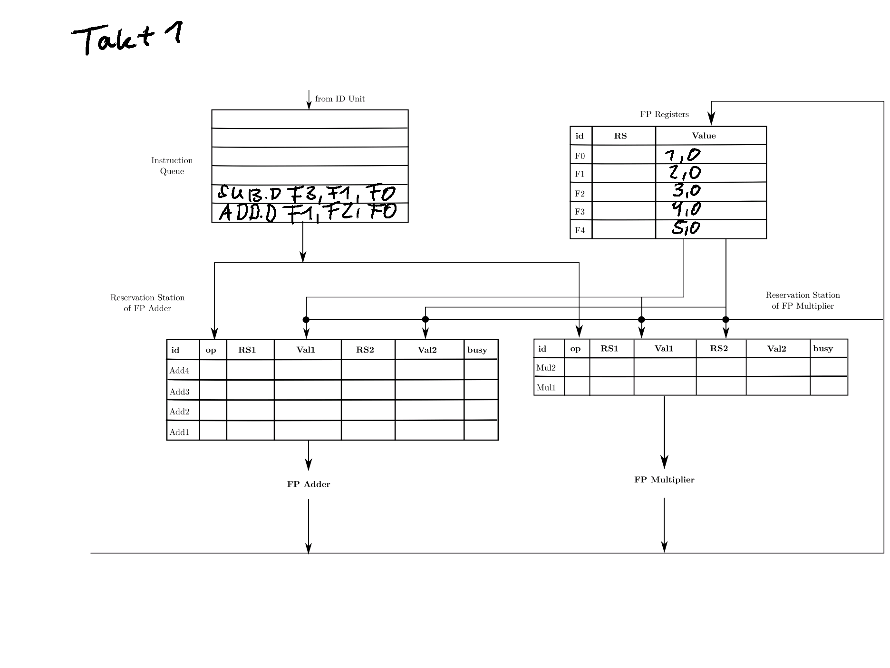
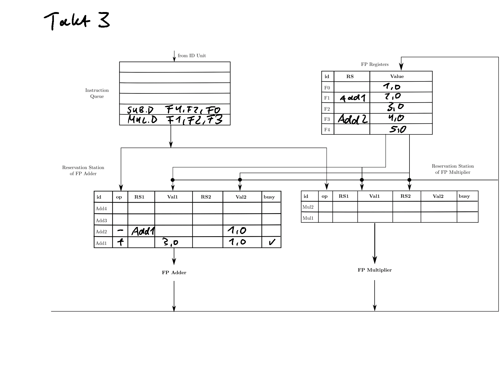
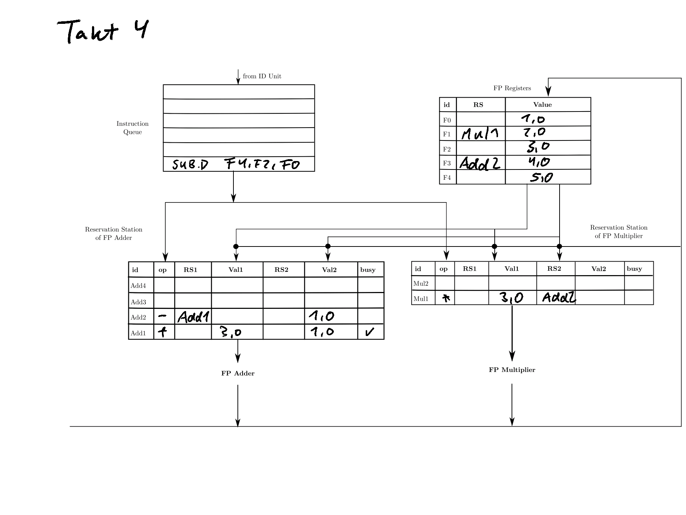
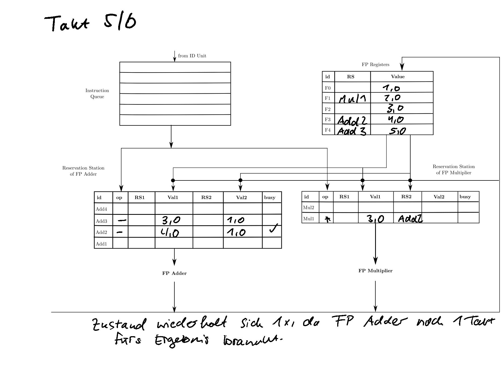
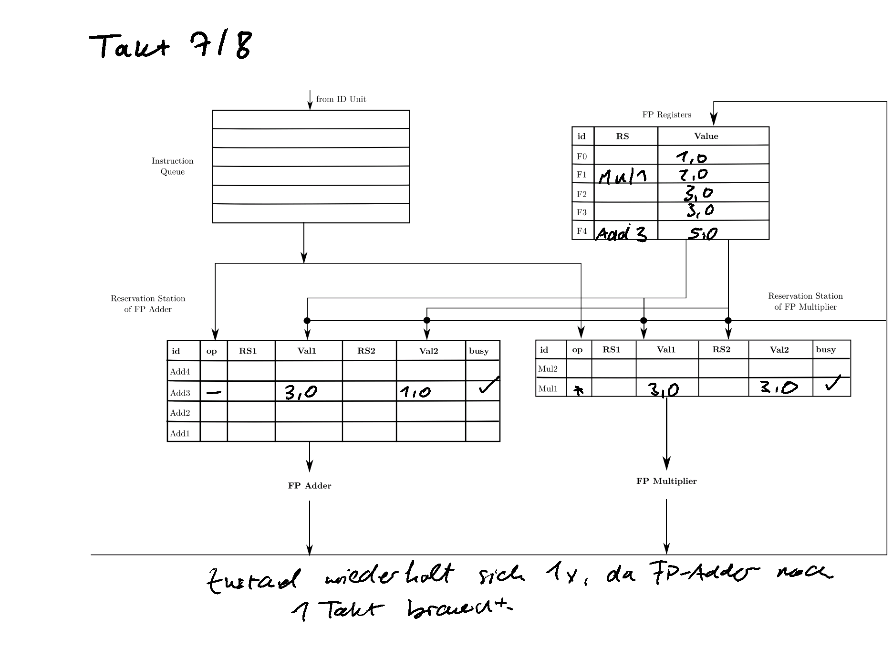
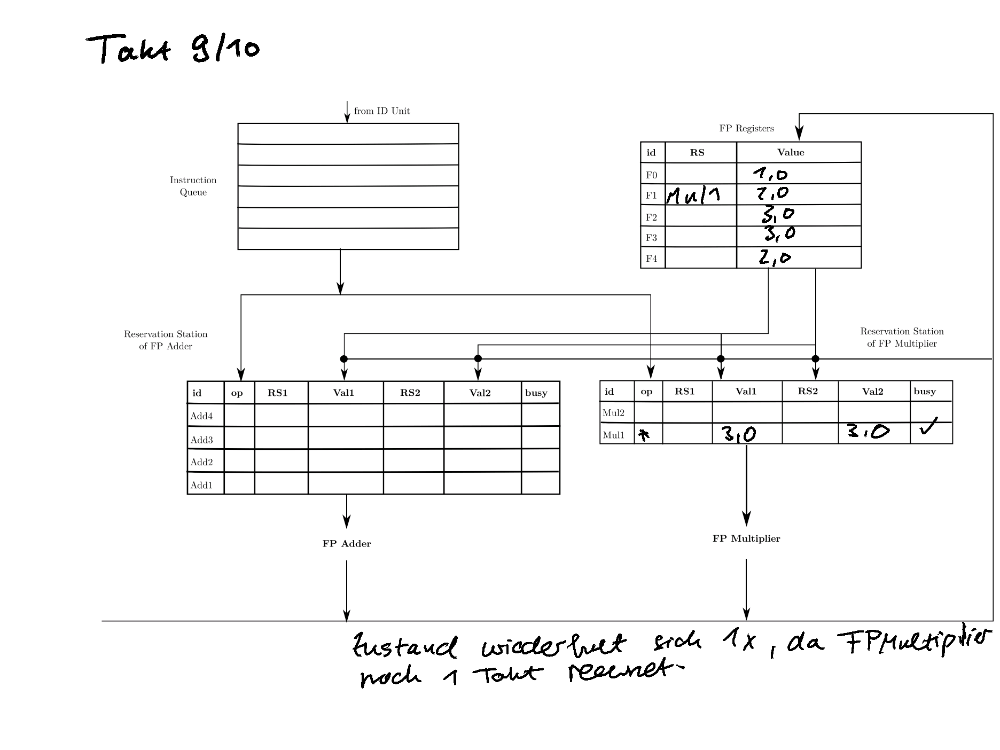
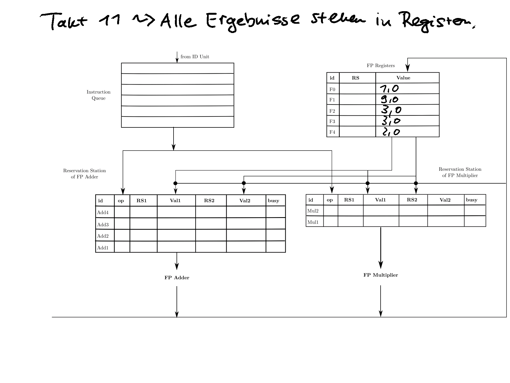
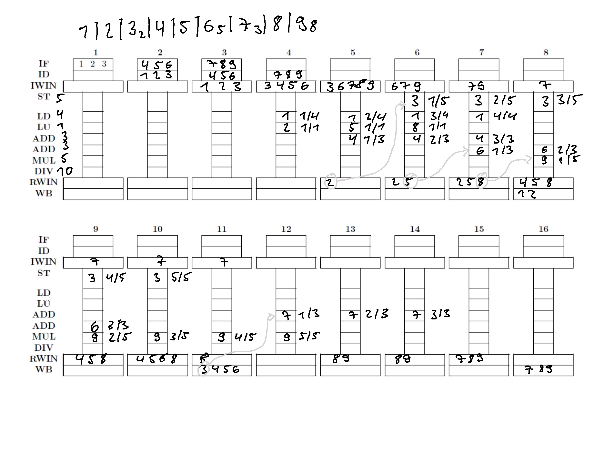

# 8. Übungszettel

## Felix Suhl, Leander Tolksdorf

### Aufgabe 1
















### Aufgabe 2

```assembly
mov $t, $s
<->
xor $t, $t, $t
or $t, $t, $s
```

Annahme: Register sind 32 bit groß und eine Adresse entspricht 8 Bit, also muss der Stack Pointer bei push/pop um 4 Adressen erhöht/verringert werden.

```assembly
push $t
<->
sw $t, 0($sp)
addi $sp, $sp, 4
```

```assembly
pop $t
<->
subi $sp, $sp, 4
lw $t, 0($sp)
```

```assembly
mult $d, $s, $t
<->
mult $s, $t
mov $d, LO
```

```assembly
div $d, $s, $t
<->
div $s, $t
mov $d, LO
```

```assembly
mod $d, $s, $t
<->
div $s, $t
mov $d, HI
```

```assembly
not $s
<->
nor $s, $s, $s
```

```assembly
clear $s
<->
or $s, $s, $s
not $s
```

```assembly
ror $s, C
<->
movi $t1, 32
subi $t1, $t1, C
subi $t1, $t1, 1
sllv $t0, $s, $t1
srl $s, $s, C
or $s, $s, $t0

Dafür:
movi $s, C
<->
xor $s, $s, $s
ori $s, C
```

```assembly
rol $s, C
<->
movi $t1, 32
subi $t1, $t1, C
subi $t1, $t1, 1
srlv $t0, $s, $t1
sll $s, $s, C
or $s, $s, $t0
```

Bei CISC werden Makrobefehle erst interpretiert und dann als Folge von Mikrobefehlen ausgeführt. In RISC gibt es den Schritt der Interpretation nicht, sondern die Befehle werden direkt von der Hardware ausgeführt. 

### Aufgabe 3

#### 1. Superskalare Pipeline



#### 2. Einfache Pipeline

| Takt | IF   | ID   | OF   | EX   | WB   |
| ---- | ---- | ---- | ---- | ---- | ---- |
| 1    | 1    |      |      |      |      |
| 2    | NOP     | 1    |      |      |      |
| 2    | NOP     |NOP      | 1    |      |      |
| 3    | NOP     | NOP     | NOP     | 1    |      |
| 4    | 2    | NOP     | NOP     | 1    |      |
| 5    | NOP     | 2    | NOP     | 1    |      |
| 6    |  NOP    | NOP     | 2    | 1    |      |
| 7    | 3    | NOP     | NOP     | 2    | 1    |
| 8    |  NOP    | 3    |  NOP    |  NOP    | 2    |
| 9    |  NOP    | NOP     | 3    | NOP     | NOP     |
| 10   |  NOP    | NOP     | NOP     | 3    | NOP     |
| 11   |  NOP    | NOP     | NOP     | 3    |  NOP    |
| 12   | 4    | NOP     | NOP     | 3    | NOP     |
| 13   | 5    | 4    | NOP     | 3    | NOP     |
| 14   | NOP     | 5    | 4    | 3    |NOP      |
| 15   | NOP     | NOP     | 5    | 4    | 3    |
| 16   | 6    | NOP     | NOP     | 5    | 4    |
| 17   | 7    | 6    | NOP     | NOP     | 5    |
| 18   | 8    | 7    | 6    |  NOP    |  NOP    |
| 19   | NOP     | 8    | 7    | 6    | NOP     |
| 20   | NOP     | NOP     | 8    | 7    | 6    |
| 21   | 9    | NOP     | NOP     | 8    | 7    |
| 22   |      | 9    |  NOP    |  NOP    | 8    |
| 23   |      |      | 9    |  NOP    |  NOP    |
| 24 |      |      |      | 9    |  NOP    |
| 25 |      |      |      |      | 9    |

Die einfache Pipeline braucht für die Abarbeitung 9 Takte mehr als die superskalare Pipeline.

#### 3. Beschleunigungsmaßnahmen für die superskalare Pipeline

- Eine Vergrößerung der IF- und ID-Einheiten würde die Abarbeitung beschleunigen, da dann bei Dependencies im IW mehr Alternativen zur Auswahl stünden. In Takt 4 könnte sich dann Instruktion 4 schon in Ausführung befinden.
- Anpassung der FCFS-Richtlinie, sodass zukünftige Abhängigkeiten beachtet werden. Das heißt zum Beispiel: Ist 4 von 3 abhängig und nichts von 2, so sollte 3 vor 2 ausgeführt werden, um möglichst schnell die Ausführung von 4 zu ermöglichen.
- Forwarding zwischen den Ausführungseinheiten

