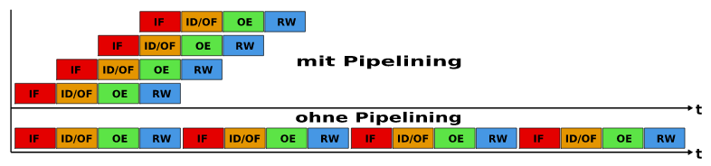
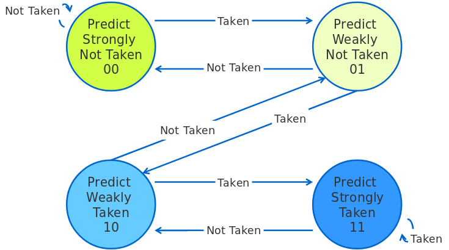

[TOC]

# Rechnerarchitektur

## Zahlensysteme

#### Hexadezimal

| Dezimal | Hexadezimal | Binär |
| ------- | ----------- | ----- |
| 0       |             |       |
| 1       |             |       |
| 2       |             |       |
| 3       |             |       |
| 4       |             |       |
|         |             |       |
|         |             |       |
|         |             |       |
|         |             |       |
|         |             |       |
|         |             |       |
|         |             |       |
|         |             |       |
|         |             |       |
|         |             |       |
|         |             |       |


## Architekturen

### Mikroprozessor

#### Aufbau

Gezeigt ist der Aufbau eines einfachen Mikroprozessors inkl. interner Busse.


#### Bestandteile

- **ALU (Arithmetic Logical Unit)**:

  Führen die vom Steuerwerk (control unit) angeforderten Rechenoperationen aus. Es gibt ALUs sowohl für Integer- als auch für Floating-Point-Arithmetik.

- **Control unit (Steuerwerk):**

  Die Control unit liest Programme Schritt für Schritt ein. Sie dekodiert die Instruktionen und sendet entsprechende Steuersignale in einer zeitlichen Abfolge an die andren Komponenten.

  Instruktionen bestehen aus **Op-Code und Operanden** (z.B. ``ADD A1, A2, A3`` ↔ A1 = A2 + A3) .

  Die Control unit besteht aus:

  - **Befehlsdecoder:** 

    Nimmt Op-Codes (in Assemblersprache) entgegen, konvertiert diese in Maschinencode und schaltet die anderen Komponenten entsprechend.

  - **Adressierwerk:**

    Wertet die relativen oder indirekten Speicheradressen des Befehls zu realen (absoluten) Speicheradressen um.

- **Bus interface:**

  Dient zur Vermittlung zwischen internem Prozessorbus und externen Bus.

  - **Interner Prozessorbus:**

    Verbindet Rechenwerk, Steuerwerk, Register, etc.

  - **Externer Bus:**

    Für den Anschluss von Peripheriecontroller und Speicher

### Von-Neumann-Architektur

#### Zielsetzung und Eigenschaften

Ein Von-Neumann-Computer

- besteht aus verschiedenen funktionalen Einheiten
- ist nicht spezialisiert auf ein bestimmtes Problem, sondern eine **general purpose machine**.

Für jedes Problem gibt es ein **Programm**, welches im Speicher liegt.

**Wichtig:**

- Instruktionen (das Programm) und Daten (I/O-Daten) liegen im *gleichen* Speicher.
- Der **Speicher** besteht aus Speicherzellen mit einer festen Länge und individuellen Adressen.

#### Aufbau


#### Bestandteile

- **Prozessor (CPU - Central Processing Unit):**

  Steuert den Kontrollfluss und die Ausführung von Instruktionen. Die CPU besteht aus:

  - **Control unit:** Interpretiert CPU-Instruktionen und generiert Kontrollcommands für andere Komponenten.
  - **Arithmetic Logical Unit:** Führt arithmetische und logische Instruktionen aus.

- **Input/Output-system (Ein-/Ausgabewerk):**

  Schnittstelle zur Außenwelt

  Eingabe und Ausgabe von Programmen und Daten

- **Speicher:**

  Lagerung von Daten und Programmen als Bitsequenzen.

- **Interconnection (Bus-System):**

  Verbindung der Komponenten miteinander.

#### Grundsätze der Datenverarbeitung

- Die CPU führt immer nur **eine Instruktion gleichzeitig** aus. Diese Instruktion ändert nur **einen Operanden gleichzeitig**. Dies wird auch **SISD (Single Instruction Single Data)** genannt.

  Es gibt auch andere Architekturen:

  - SIMD
  - MISD
  - MIMD

- Programmcode und Daten liegen im **gleichen Speicher** und werden nicht unterschieden.

  - Folge davon: Es gibt keine Schutzmechanismen zwischen Programmen und Daten. Programme können also andere Programme zerstören oder auf falsche Daten zugreifen.

- **Zwei-Phasen-Prinzip:**

  Wichtig: Die Speicherinhalte werden immer nur **interpretiert**. Der Speicher weiß also nicht, ob eine Bitsequenz eine Instruktion oder Daten darstellt.

  1. **Interpretation:** Der Program Counter gibt an, welche Speicherzelle gefetcht wird. Der Inhalt dieser Speicherzelle wird dann als Instruktion *interpretiert*.
  2. **Ausführung:** Die Instruktion gibt an, welche Speicherzellen als Operanden gefetcht werden. Der Inhalt diere Speicherzelle wird dann als Daten *interpretiert*.

#### Vor- und Nachteile

**Vorteile:**

- Minimale Hardwareanforderungen: Die Anzahl der Einheiten ist klein.
- Minimale Speicheranforderungen: Es gibt genau einen *general purpose* Speicher für Daten und Programme.

**Nachteile:**

- **Von-Neumann-Flaschenhals:** Das Bus-System (Memory ↔ CPU) ist der Flaschenhals und limitierender Faktor im V-N-Architektur.
- Programme müssen den Datenfluss durch den Flaschenhals berücksichtigen.
- Schwache Strukturierung von Daten.
- Kein Speicherschutz.

### Harvard-Architektur

#### Zielsetzung und Eigenschaften

**Grundprinzip der Harvard-Architektur:** Trennung von Daten- und Programmspeicher.

Das hat eine Leistungssteigerung zur Folge, da die Harvard-Architektur nun gleichzeitig Instruktionen und Daten fetchen kann. 

#### Bestandteile

In der Harvard-Architektur ist der Befehlsspeicher logisch und physisch vom Datenspeicher getrennt.

#### Vorteile & Nachteile

**Vorteile:**

- Erhöhte Rechenleistung und -geschwindigkeit.
- Bei fehlerhafter Software kann durch Trennung von Programm- und Datenspeicher kein Programmcode, sondern allenfalls Daten zerstört werden können.

**Nachteile:**

- Freier Programmspeicher kann nicht für Daten genutzt werden.
- Freier Datenspeicher kann nicht für Programme genutzt werden.

---

## Pipelines

#### Instruktion

Die Abbarbeitung einer Instruktion wird meist in 4 oder 5 Unterschritte eingeteilt.

1. **[IF] Instruction Fetch:** 

   - Die Instruktion wird aus dem Speicher geholt und ins Befehlsregister geschrieben.
   - Der Program Counter wird inkrementiert.

2. **[ID] Instruction Decode:** 

   Die Instruktion wird dekodiert:

   - Welche Operation wird ausgeführt?
   - Welche Operanden werden benötigt?

3. **[OF] Operand Fetch:** 

   Das Adressierwerk wertet den Adressteil der Instruktion aus und lädt die benötigten Operanden aus dem Speicher.

4. **[EX] Execution:**

   Das Rechenwerk führt die Instruktion aus.

5. **[WB] Write back:**

   Das Ergebnis der Operation wird entweder in ein Register oder in den Speicher zurückgeschrieben.

#### Zielsetzung

Ohne Pipelining werden alle Instruktionen mit ihren Unterschritten sequentiell hintereinander ausgeführt. 

- Dadurch dauert die Abarbeitung sehr lange und
- Es ist immer nur eine Phase gleichzeitig aktiv. Die anderen vier sind währenddessen im Leerlauf.

Mit Pipelining sind möglichst immer alle Phasen aktiv. Das erreicht man durch nebenläufige versetzte Abarbeitung von mehreren Instruktionen gleichzeitig.



#### Probleme

##### Datenkonflikte (Data hazards)

entstehen bei Datenabhängigkeiten zwischen Befehlen im Programm.

```Assembly
(1) R1 = R2 + R3
(2) R4 = R1 + 1
; (2) benötigt R1 als Operanden. (1) ist möglicherweise noch nicht mit dem 
; Write-Back fertig, bevor (2) ausgeführt wird.
; So könnte am Ende ein falsches Ergebnis in R4 stehen.
```

Es gibt drei Arten von Data hazards:

- **Read after Write (RAW)**: Instruktion 1 versucht, Operanden zu lesen, bevor Instruktion 2 ihn schreibt.

  ist eine **"True Dependency"**

- **Write after Read (WAR):** Instruktion 2 versucht, Operanden zu schreiben, bevor Instruktion 1 ihn liest.

- **Write after Write (WAW):** Instruktion 2 versucht, Operanden zu schreiben, bevor Instruktion 1 ihn schreibt.

**WARs und WAWs** können in einer einfachen 5-stufigen Pipeline **nicht** auftreten, weil:

- Alle Instruktionen 5 Stufen durchlaufen
- Lesende Registerzugriffe *immer* in Stufe 2 passieren.
- Schreibende Registerzugriffe *immer* in Stufe 5 passieren.

**WARs und WAWs** könnten z.B. in superskalaren Pipelines auftreten.

**Software-Lösungen zur Vermeidung von Data hazards:**

- Einfügen von Leerbefehlen (NOPs) hinter jeder konflikterzeugenden Instruktion
- Instruction scheduling (Neustrukturierung von Code, um NOPs zu vermeiden)

**Hardware-Lösungen zur Vermeidung von Data hazards:**

- Einfügen von Verzögerungen (Stalling/Interlocking) - Entspricht im Grunde einem Leerbefehl.

- **Forwarding:**
  
  Bei einem Data Hazard spart Forwarding einen Takt, da in Instr2 die EX-Phase bereits nach der EX-Phase von Inst1 starten kann und nicht erst nach WB.
  
  - **Result forwarding:** Das Ergebnis der EX-Stufe wird schon vor dem Write-back zur nächsten Instruktion weitergeleitet.
  - **Load forwarding:** The load memory data register from MEM stage can be forwarded to ALU input of EX stage.
  
- **Forwarding mit Interlocking:**
  
  - Angenommen, Instruktion 2 ist datenabhängig von Instruktion 1. Dann wird Instruktion 2 gestallt, bis die von Instruktion 1 geladenen Daten im Loiad memory data register in MEM verfügbar sind.

---

##### Strukturkonflike (Structural hazards) 


**Lösungen zur Vermeidung von Sturkturkonflikten:**

- Arbitration with interlocking: hardware that performs resource vonflict arbitration and interlocks one of the competing instructions
- **Resource replication**

---

##### Steuerkonflikte (Control hazards)

- Bedingte Sprünge und branches unterbrechen die lineare Programmausführung (Der Program Counter wird verändert.). Das Programm könnte also an einer anderen Stelle weitermachen.
- Sprungbefehle werden in der ID-Phase erkannt. Währenddessen sind der Pipeline schon die nächsten Instruktionen bekannt.

**Hardware-Lösungen für Steuerkonflikte:**

- **Pipeline flushing:** Die Pipeline wird vor der Ausführung des Sprungbefehls geleert.
- **Speculative Branch:**
  - Bei einem bedingten Sprung: Ergebnis der Bedingung schätzen und Pipeline spekulativ vorladen.
  - War die Vorhersage falsch: Pipeline flushing.
  - **BRANCH PREDICTION**

#### Lösungen

##### Branch Prediction

Branch prediction versucht, den Wert einer logischen Kondition vorherzusagen und die weitere Programmausführung darauf aufbauend vorzubereiten.

Es gibt zwei Arten von Branch prediction:

**Statische branch prediction:**

- Die Sprungvorhersage bleibt während des Programmablaufs gleich.
- Sie geht von Tatsachen aus, wie:
  - Schleifen führen häufig Sprünge aus:
  - Auswahlverfahren (if-else) führen seltener Sprünge aus.
- Statische b.p. hat eine Vorhersagegenauigkeit von 55% - 80 %.

Statische branch prediction kann implementiert werden durch:

- **machine-fixed prediction:** z.B. always predict taken

  - Wired taken/not taken prediction:

    Die Vorhersage wird fest in der CPU verdrahtet. Also wird immer von taken oder immer von not taken ausgegangen.

  - Direction based prediction:

    *Backward branches* werden als taken vorhergesagt und *forward branches* als not taken.

    (Geeignet für Schleifen)

- **compiler-driven prediction:**

  Zwei Herangehensweisen:

  - Analyse des Programmcodes
  - Nutzung von Erfahrungen aus früheren Ausführungen


**Dynamische branch prediction:**

- Vorhersagen werden dynamisch während der Laufzeit getroffen.
- Die Programmhistorie entscheidet dabei über die nächste Vorhersage.
- Dynamische b.p. hat i.d.R. eine höhere Genauigkeit, ist aber wesentlich komplexer (Hardware) als statische.

**One-bit-Prediction**


Ein One-Bit-Predictor sagt Sprünge am Ende einer Schleife so lange korrekt voraus, bis die Schleife abbricht.

**Problem:**

In verschachtelten Schleifen werden zwei falsche Vorhersagen in der inneren Schleife getroffen.

1. Am Ende der Schleife, wenn die Iteration abbricht statt sich zu wiederholen.
2. Bei der Ausführung der ersten Iteration. Es wird Exit vorhergesagt aber weiter iteriert.

Dieses Problem löst der *Two-bit-predictor.*

**Two-bit-prediction**

*Hysteresis Scheme*


*Saturation counter scheme*

